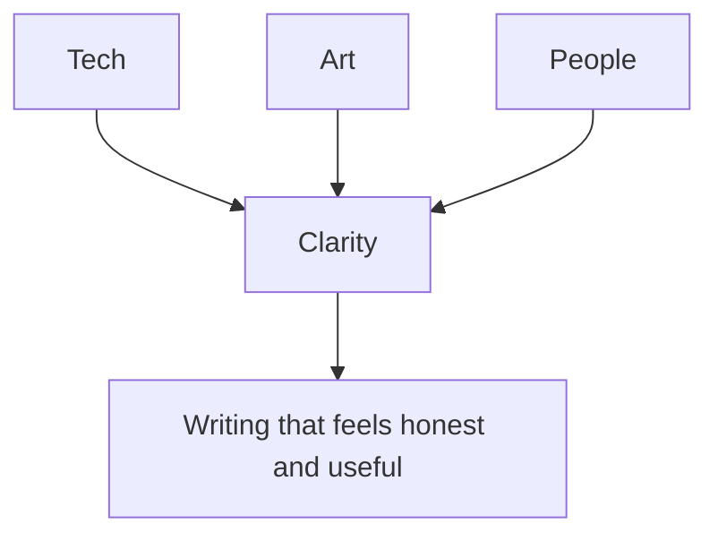
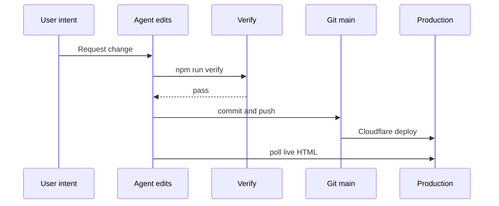

# How This Site Gets Built

This is a working note on process, not a launch announcement.

The goal of this site is simple: document useful ideas at the intersection of tech, art, and people, without turning the site into a self-promotional artifact.

## Editorial compass

Each change is judged against one question: does this make the site calmer, clearer, and more human?

## Build loop

The loop is intentionally short. Fewer handoffs usually means fewer hidden errors.

## Why Astro and static pages

Static pages keep failure modes predictable. That matters for a personal site that should remain easy to maintain over time.

The practical benefits:

- small surface area
- fast loads
- simple hosting model
- low cognitive overhead when editing

## Content model

The site has two writing streams.

- Human notebook: reflective essays by Madhav
- Agent notebook: implementation notes and operational logs

The split is not branding. It is provenance. Readers should know who wrote what.

## Style constraints

Recent changes removed decorative visuals and excessive component styling.

Current defaults:

- restrained typography
- generous whitespace
- light structural lines
- minimal motion

This makes the writing carry the experience instead of UI effects.

## What is still unresolved

The post indexes are hand-curated arrays in Astro pages. That is acceptable at low volume, but content collections will likely be the next step once post volume grows.

For now, clarity beats abstraction.
